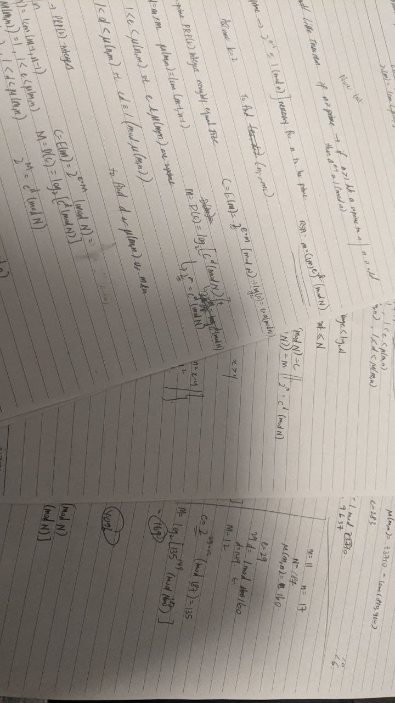
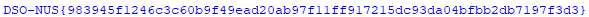

# PoorMen (38 Solves; 149 Points)
Category: Web/Crypto
> I followed the description in the section 5.3 to implement the cryptosystem. However, my friend who is a crypto expert told me that there's something wrong about this, can you figure it out?

For this challenge, we were given a single task: to decode the ciphertext given in `data.txt`.
Based on some hindsight information, this challenge was created by the NUS-side, which explains why there is a whole academic paper for me to digest before starting.  

At first glance, we are given an asymmetric cryptosystem, named "RSA for poor men" (haha fitting).
This cryptosystem appears to be a variant on the RSA algorithm.

The key differences between RSA and this cryptosystem are as follows:
* Choice of `p`, `q` used to generate the public and private keys.
    * RSA: 2 sufficiently large primes
    * Poorman RSA: 2 sufficiently large pseudoprimes generated using a specific algorithm outlined in the paper itself
    
* Encryption and Decryption algorithm
    * I'll leave it up as a reader's exercise to decipher the paper and google RSA.
    

Since I was not familiar with RSA to begin with, I began looking into RSA and ways to crack RSA.
While doing research, I came across a website that outlined 15 methods to breaking RSA. (https://speakerdeck.com/rlifchitz/15-ways-to-break-rsa-security)

TLDR; to break RSA, we need _**any**_ one of the following:
* Decryption/private Key `d` (duh...)
* Private factors `p` _or_ `q` (only one needed since `N` is provided as part of the public key)
* Toitent function (used to calculate conditions for the public and private exponents)

One of these methods stood out to me - Batch GCD. Since there were multiple key pairs, the hope was to find a common factor among the public exponents.
I created `testing for common factors.py` for this purpose, but it ultimately yielded me with nothing.

There was another method - Fernat factorisation. I created a python script `fermat_test.py` and let it run in the background while I figured out another method of decrypting this.

I then went to take a deeper look at the paper, and try to manually trace the algorithm to gain a deeper understanding.
At this point, trying to crack it through the similarities between this and RSA was thrown out of the window.

In my `test.py`, I basically tried to recreate a rudimentary version of the algorithm. 
However, I kept running into issues where I was not getting back the original message. Weird.
I then took to pen and paper to try to run the algorithm manually. 

I knocked my head on this for a few hours in the night, until I saw that there was an example of the algorithm execution.
There, I saw the magical line that led me to the answer.
> The system accepts messages 1 < M < log2(N)

For some context, logarithmic functions grow incredibly slowly, especially with extremely large N that was given to me.
So instead of trying to brute force `d`, I can try to brute force the plaintext by passing it through the encryption oracle that decrypts using this algorithm.

And this is exactly what I did in `chosen plaintext_test.py`, where I copied out the first 2 sets of public keys and ciphertext as my proof of concept.
I then brute forced the integer plaintext from 0 until the chosen plaintext is equal to the ciphertext.

Boy, was I happy to see the first 2 characters of the flag: `D` and `S`.

Then I took this function and included it in my full script `chosen plaintext.py` that read `data.txt`, and spits out flag for me.

And this marks the end of my first (actual?) key that I had to code something out specifically for.

