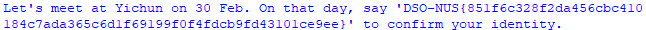

# ProtectTheVaccine (66 Solves; 147 Points)
Category: Web/Crypto
> A nation-supported hacker group is using their cutting edge technology to attack a company that develops vaccine. They roll their own crypto with a hope that it will be more secure. Luckily, we have got some of their crypto system information and also have found some research that is likely to break their crypto system. I heard you are a cipher breaker, could you help us to decrypt their secret and protect the vaccine from their plan?

For this challenge, we were supposed to decode an RSA-encrypted ciphertext.
The caveat is: The value of `N` is dso disgusting large that conventional attacks to the RSA cryptosystem would take way too long to compute.

Looking at `data.txt`, we observe the standard public key `(e, N)` and the ciphertext `c`.

What is interesting is that we are provided with residual `p` and `q` (i.e. last few buts of `p` and `q`). 
How we got a hold of these residual values is beyond the scope of this challenge.

This is where the paper provided comes in. 
A short summary: if the last few bits of `p` and `q` is known, we can break RSA encryption easily (compared to brute forcing it that is).

I will spare the reader the specifics as to how this algorithm works. (Refer to the paper if you're so hell-bent).

To get to understand the steps of the algorithm, I referred to their example, where I tried to convert their algorithm into python code and lifted their example values for testing.

First, under `rsa_special_test.py`, the example values were used in my algorithm, and I tried to run the algorithm using my code, and verify that I could obtain the resulting `p` and `q` values given by the paper.
Since the values used are so big, python primitive-equivalents could not be used. Instead, I used the `Decimal` library to store my annoyingly large numbers.

_Note to self: Set the precision sufficiently high to at least capture all the integer values - caused me so much trouble for like one hour because of this_

After verifying that the algorithm and code works, time to move onto the actual cracking.
With the concrete understanding, I made `rsa_special.py` to crack the ciphertext and output the flag.
A relatively simple task in stark contrast to the work done previously.

