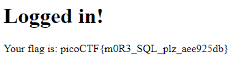

#Irish Name Repo 2
> There is a website running at https://jupiter.challenges.picoctf.org/problem/64649/ (link). Someone has bypassed the login before, and now it's being strengthened. Try to see if you can still login! or http://jupiter.challenges.picoctf.org:64649
> 
An extension to the challenge of the same name.

Somehow, trying the same payload (`admin'--`) as from the previous challenge gets me the flag also.  

But the server detects my first, more complex attempt somehow (`admin' OR 1=1'--`). Maybe the server is configured to detect `OR` inputs?

##Lessons
* Just go with something simple.