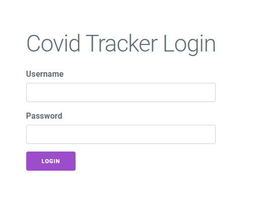
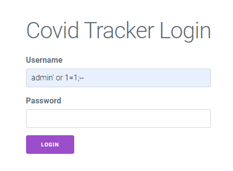
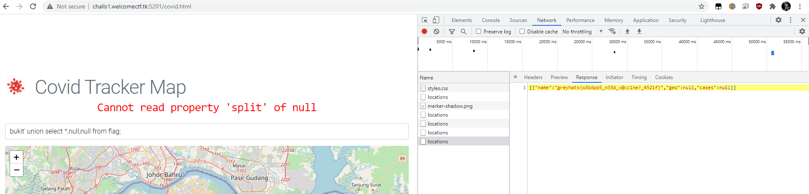

# CovidTracker (68 Solves; 50 Points)
Category: Web
> I made a Covid Tracker to see track how many Covid cases are around. I'm hoping I get injected with the vaccine soon.
>
> challs1.nusgreyhats.org:5201

For this challenge, we were given a website and what appears to be the source file for the website.

Going to the website, we are presented with a login screen and not much additional information.

Diving into the source code, it appears that this could be a case of SQL injection (if the challenge description was not clear enough).

To bypass the login screen, we would have to inject the payload such that:
* The SQL query does not error and,
* The username is `admin`.

Simple enough, just inject username: `admin' or 1=1;--`, so that the underlying query becomes `SELECT username FROM users WHERE username='admin' or 1=1;-- AND password='${password}'`.

After bypassing the first screen, we are presented with a map with a field for text input.
Looking into the source code, this seems to be another round of SQL injection.

From the code, the flag is within the same database, but in a different table. So to retrieve the value, we can just append a `UNION` operator to make the backend query the other table for the flag.

Note to self: when union-ing two sql queries together, they have to have the same number of fields

Looking at the response, it appears that we have successfully retrieved the flag.
> greyhats{w3bApp5_n33d_v@cc1ne?_4521f}
