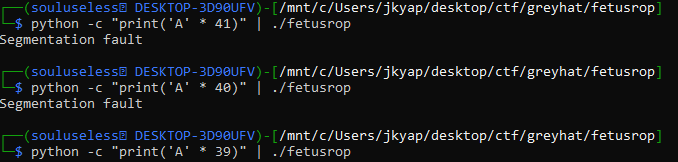
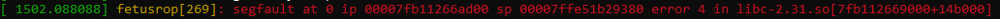

# WelcomeCTF "ROP gauntlet"
Category: Pwn

The following writeup is a combination of three separate challenges linked together by the use of the same technique, but in increasing complexity.

Specifically, they involve return-oriented programming (ROP) chaining, with each subsequent challenge requiring additional code to workaround the tighter restrictions.

This was my first time applying ROP in CTF, so I am very grateful for the gradual introduction to ROP.

Below are a set of links that I found useful in my understanding of ROP:
* https://www.ired.team/offensive-security/code-injection-process-injection/binary-exploitation/rop-chaining-return-oriented-programming
* https://www.youtube.com/watch?v=i5-cWI_HV8o

For all the challenges, we are presented with a `tar.gz` file which provided the source code, as well as the libc that was used to compile the code.

## fetusrop (23 Solves; 413 Points)
> Begin your journey on return-oriented programming.
> 
> nc challs1.nusgreyhats.org 5011

In the source code provided, it appears that I have to overflow the buffer precisely and overwrite the return pointer to point to the `win` function.
In addition, I have to chain two parameters `a` and `b` to clear the if statement.

First things first, I would have to find out what is the specific byte offset that I would need to overflow the buffer precisely.

Looking at the source code, it appears that the buffer is 32 bytes large. 
I would then require an additional 8 bytes of data to overflow the base pointer to gain access to the return pointer.

So all in all I would require 40 bytes to cause an segmentation fault at just the right offset.
To test this, I printed out 40 'A' using python and piped them into the provided binary using `python -c "print('A' * 40)" | ./fetusrop`.

Sure enough, I caused a segmentation fault.

Looking at `dmesg`, it appears that the return address has been reached, which also indicates that 40 is the correct offset.

Now that we know the offset, we can then start working on our exploit.
`pwntools` provides a library for ROP chaining, aptly named `ROP`. 

Assuming that the same binary provided is being run on the remote, we can simply load the ELF binary and use that to obtain all the memory addresses required.
Then we can construct the payload using the found offset and `rop.chain()` and fire that off into the remote to gain shell access.

> greyhats{y0ur_pwn_j0urn3y_b3g1ns_982h89h}

## babyrop (17 Solves; 454 Points)
> You are ready for more return-oriented programming.
>
> nc challs1.nusgreyhats.org 5012

Babyrop is one level up from fetusrop.
The main difference here is how there is now not a simple `win` function to execute, but rather two rather peculiar chunks in the binary: `system` and `/bin/sh`.

Otherwise, all the other environment parameters remain the same (even the offset).

So this boils down to:
* Instead of calling the `win` function, we call `system`
* Instead of parsing in two hex values as parameters, we find `/bin/sh` in the binary and parse it as the parameters instead.

However, it is also necessary to chain a "filler" call in the ROP chain to align the stack so that the system call can run properly.

Finally, we construct the payload and fire it off to the remote to get our flag.

> greyhats{4n_e4sy_0ne_f0r_y0u_82hhd2dh8dh}

## kidrop (12 Solves; 479 Points)
> I take away `system`, what can you do now?
>
> nc challs1.nusgreyhats.org 5013

Kidrop is yet another level up from babyrop.
The twist now is that we are now not provided with any variables or gadgets that we can use in the compiled binary itself.

However, we do know the libc that is used by the binary, so we can use that to obtain gadgets that call `system` and contain the string `/bin/sh`.

However, before we can use the libc binary to ROP, we first have to find the libc base on the remote so that we can calculate the memory address to ROP to.

To achieve this, we first construct a ROP chain that leaks the memory location of a known function in the remote Global Offet Table (GOT).
In the exploit, I used `puts`, before chaining back into the `main` function to await my second ROP chain. 

Since a 64-bit machine used 56-bit addresses, we then have to pad it the address with 8 nullbytes so that everything is aligned properly.

Then we can just set the libc base address on our local machine to be the same as the remote.

Now, everything should be set up properly and all that is left is to construct the payload and fire that off.

> greyhats{g00d_j0b_d0ing_l1bc_l34k_2y389hd82}