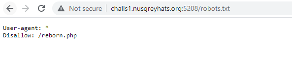
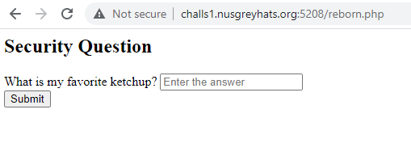
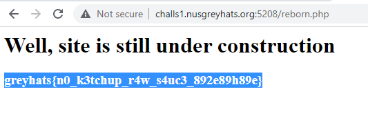

# No Ketchup, Just Sauce (47 Solves; 108 Points)
Category: Web
> Building my ketchup startup at
> http://challs1.nusgreyhats.org:5208/

For this challenge, we are only presented with a single website, that appears to be under construction...?

Looking at the developer tools panel, it also appears that there is no information to be obtained as well.

However, sometimes websites have information about their pages within their `robots.txt` file.

And what do we know, `http://challs1.nusgreyhats.org:5208/robots.txt` does exist!

It seems that there is one page `/reborn.php`, so let's look into it.
In this, there was a simple text field with a corresponding submit button.
The text field does not appear to be susceptible to the common vulnerabilities, which indicate to me that this information is hidden somewhere.

Looking at the developer tools panel once again, there seems to be a comment about how there is a older backup file.
Going by this hint, it might appear that there is some method of obtaining an older version like Git or Archive.org.

After a few hours of getting nowhere with that, I tried appending a `.bak` to `reborn.php`.
Apparently, that exists, and a file called `reborn.php.bak` was downloaded. 

After looking into the source code, I was able to find the answer to the security question and retrieve the flag.

