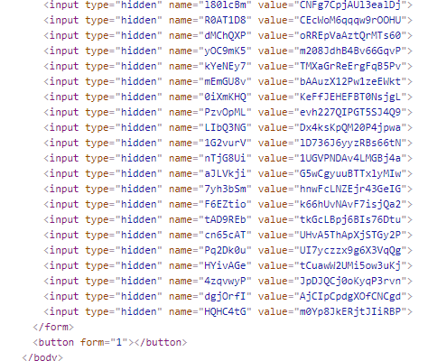

# No Submit Security (85 Solves; 50 Points)
Category: Web
> I heard that my website is leaking some secret when a button is clicked, so I removed that button. I think it should be secure enough now.
> 
> http://challs1.nusgreyhats.org:5217/

For this challenge, we are provided with a link to a website.

Looking at the developer console, there seems to be a hidden form, but without a submit button.

Going by the "recommendation" of the challenge description, I altered the html to make a button appear.

After clicking the newly created button, I was redirected to another page that contains the flag.
> greyhats{5U8m1551O5_15_FRoM_tH3_CL13Nt_51d3}