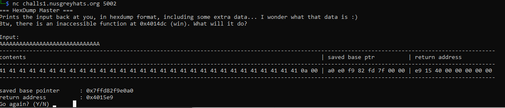

# hexdump-bof (15 Solves; 465 Points)
Category: Pwn
> I wrote an hexdump converter service with my friend. He said that it looked very vulnerable, and volunteered to 'fix' it. I'm not quite sure he did ...

> Connect via
> nc challs1.nusgreyhats.org 5002

Personal note: This challenge came at the perfect time for me as I wanted to learn how to execute a BOF attack. 
Previously, I only roughly learnt the theory and what is supposed to happen, so the fact that everything is visualised cemented my understanding.

For this challenge, we are provided with a domain and a port to netcat to. Let us do just that.

Upon connection, we are presented with instructions on how to use the hexdump service, and as well as the memory address of the function that we have to call.

From the responses, it appears that the whole memory stack is laid bare for us to see.
We just have to enter just enough characters for us to overflow the contents and base ptr and overwrite the return address.

This act of overflowing the contents and base pointer and overwriting the return address is also known as buffer overflow (BOF).

Luckily, the memory address is also provided in the challenge description, so all that is left is to string together the exploit and execute it.

Subsequently, we just have to terminate the hexdump process on the remote to gain access to shell and, consequently, the flag.
> greyhats{b0f_m4d3_ezpz_345ff}