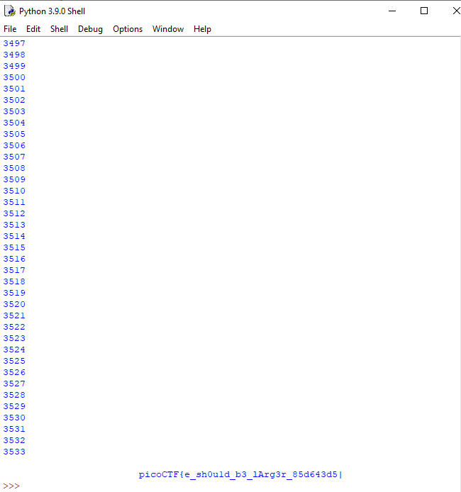

# Mini RSA (70 Points)
Category: Cryptography
> What happens if you have a small exponent? There is a twist though, we padded the plaintext so that (M ** e) is just barely larger than N. 

For this challenge, we were given a textbook RSA encrypted ciphertext, with a small exponent and M ** e is slightly larger than N.
The small exponent will turn out to the crux of the challenge.

Usually, RSA will choose a large exponent and M ** e to be much larger than N, to ensure that it becomes computationally unfeasible to bruteforce and reverse the equation.

However, that is exactly what we will be doing for this challenge.

To reverse the encryption, we will first need to look at the encryption equation of RSA:  
 (credits to Wikipedia)

From the equation, we can basically see that the encryption is a basic modulus equation, and can be rewritten as below:
 , for some k.

Given how the challenge mentioned how the M ** e is barely larger than N, we can deduce that k is likely to be a small value, and thus bruteforce-able.

Furthermore, the small e also made it much easier to compute inverse powers as well.

This was how `mini rsa.py` was conceptualised.

## Learning Points
* Deeper understanding of how RSA works.
* Given a textbook cryptosystem, look at the restrictions given by the challenge to see if there are any vulnerabilities introduced by the challenge to make it easier.
