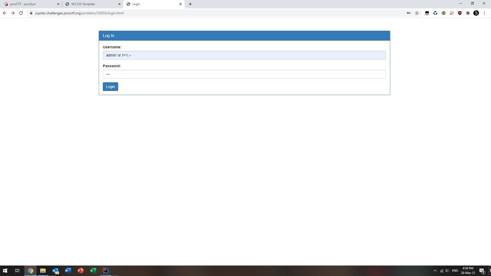
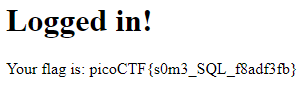

#Irish-Name-Repo 1
Category: Web Exploitation (SQLi)
> There is a website running at https://jupiter.challenges.picoctf.org/problem/33850/ (link) or http://jupiter.challenges.picoctf.org:33850. Do you think you can log us in? Try to see if you can login!

Basically this challenge only involves finding the login page, and finding a way to log in as the admin.

Whenever I find that there is a field to be filled in, I immediately think of SQLi.

I did a standard litmus test for SQLi of a single quotation mark. And I got an Error 500 instead of a Login Failed Screen.

Now applying what I have learnt with regards to SQLi, is to roughly guess what is the backend SQL statement.

My first guess would be:
`'<login> WHERE USERNAME=<username> AND PASSWORD=<password>'`

Given the guess, it would be clear that my payload would be at the username field:
`admin' OR 1=1;--`. The `OR 1=1` serves to bypass whatever authentication checks present in the backend.

Surprisingly, that actually worked.  

Although, there is not much room for automation (at least not with my current skillset). I have heard of some people who created their own browser extension to automatically perform SQL injection.
##Lessons
* Check for SQLi vulnerability whenever there is a text field
* This was but a baby SQL flag, there's much more sophisticated SQL injections that I've seen before such as prepared statements and obfuscation.